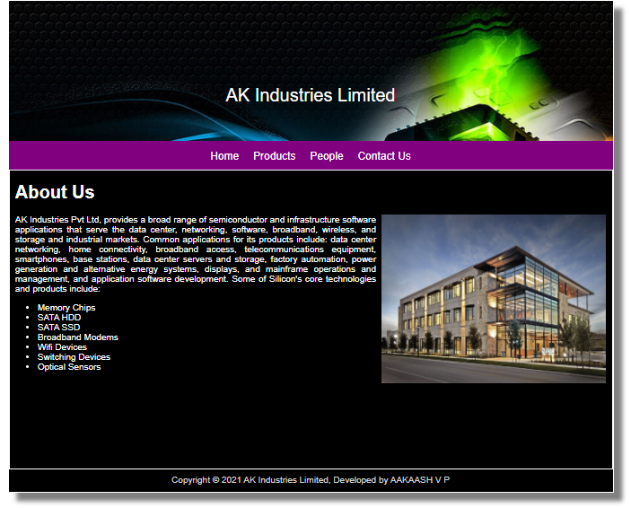
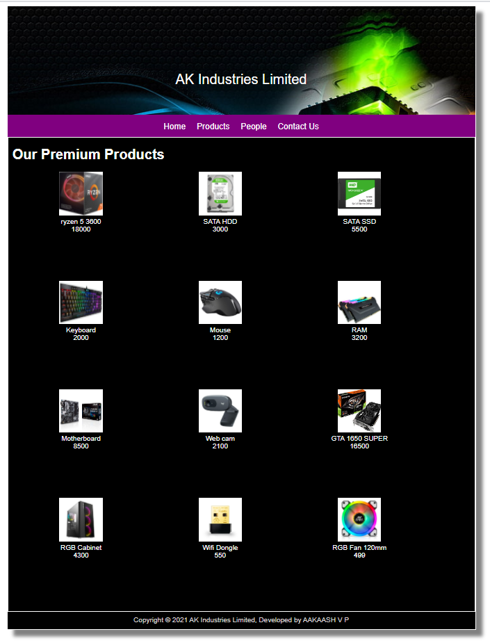
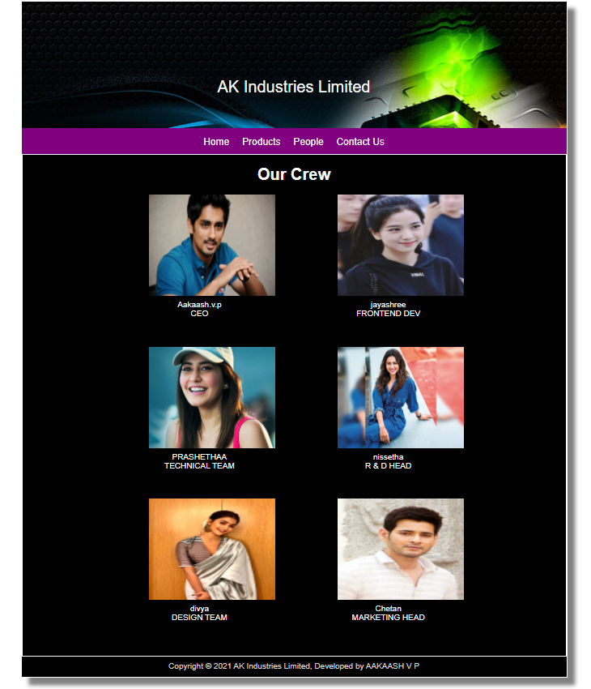
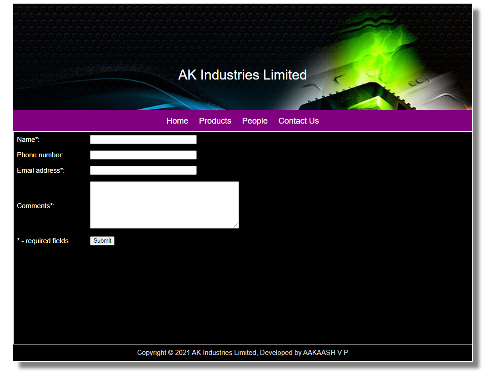

# Dynamic Website Design for a Manufacturing Company
## AIM:
To design a dynamic website for a chip manufacturing company.

## DESIGN STEPS:
### Step 1: 
Requirement collection.
### Step 2:
Creating the layout using HTML and CSS.
### Step 3:
Updating the sample content.
### Step 4:
Choose the appropriate style and color scheme.
### Step 5:
Validate the layout in various browsers.
### Step 6:
Validate the HTML code.
### Step 7:
Create a database model and migrate the database.
### Step 8:
Retrieve data from database and display it in a dynamic webpage.
### Step 9:
Publish the website in the given URL.

## PROGRAM:

### base.html
```

<!DOCTYPE html>
<html lang="en">

<head>
    <title> AK Industries Limited </title>
    <link rel="stylesheet" href="">
    <link rel = "icon" href ="" type = "image/x-icon"> 
              
</head>

<body>
    <div class="container">
    <div class="banner">
        AK Industries Limited
    </div>
    <div class="menu">
        <div class="menuitem"><a href="/home">Home</a></div> 
        <div class="menuitem"><a href="/products">Products</a></div> 
        <div class="menuitem"><a href="/people">People</a></div>
        <div class="menuitem"><a href="/contactus">Contact Us</a></div> 
    </div><div class="content">
        
    
    </div>
    <div class="footer">
        Copyright © 2021 AK Industries Limited, Developed by AAKAASH V P
    </div>
    </div>
</body>

</html>
```
### home.html
```



    <div class="homecontent">    
    <h1>About Us</h1>
    
    <div class="contenttext">
    AK Industries Pvt Ltd, provides a broad range of semiconductor and infrastructure software applications that serve the data center, networking, software, broadband, wireless, and storage and industrial markets. Common applications for its products include: data center networking, home connectivity, broadband access, telecommunications equipment, smartphones, base stations, data center servers and storage, factory automation, power generation and alternative energy systems, displays, and mainframe operations and management, and application software development. Some of Silicon's core technologies and products include:
    <ul>
        <li>Memory Chips</li>
        <li>SATA HDD</li>
        <li>SATA SSD </li>
        <li>Broadband Modems</li>
        <li>Wifi Devices</li>
        <li>Switching Devices</li>
        <li>Optical Sensors</li>
    </ul> 
    </div>
    </div>

```

### people.html
```



<div class="peoplecontent">
    <h1>Our Crew</h1>
    <div class="crewmembers">
        
        <div class="crewmember">
            <div class="memberimage">
                
            </div>
            <div class="membername">{{ people.name }}</div>
            <div class="designation">{{ people.designation }}</div>
        </div>
        
    </div>
</div>


```

### products.html
```



<div class="productcontent">
    <h1>Our Premium Products</h1>
    <div class="productitems">
        
        <div class="productitem">
            <div class="itemimage">
                
            </div>
            <div class="productsname">{{ products.name }}</div>
            <div class="productsprice">{{ products.price }}</div>
        </div>
        
    </div>
</div>

```

### contactus.html
```



<form action="//submit.form" id="ContactUs100" method="post" onsubmit="return ValidateForm(this);">
<script type="text/javascript">
function ValidateForm(frm) {
if (frm.Name.value == "") { alert('Name is required.'); frm.Name.focus(); return false; }
if (frm.FromEmailAddress.value == "") { alert('Email address is required.'); frm.FromEmailAddress.focus(); return false; }
if (frm.FromEmailAddress.value.indexOf("@") < 1 || frm.FromEmailAddress.value.indexOf(".") < 1) { alert('Please enter a valid email address.'); frm.FromEmailAddress.focus(); return false; }
if (frm.Comments.value == "") { alert('Please enter comments or questions.'); frm.Comments.focus(); return false; }
return true; }
</script>
<table style="width:100%;max-width:550px;border:0;" cellpadding="8" cellspacing="0">
<tr> <td>
<label for="Name">Name*:</label>
</td> <td>
<input name="Name" type="text" maxlength="60" style="width:100%;max-width:250px;" />
</td> </tr> <tr> <td>
<label for="PhoneNumber">Phone number:</label>
</td> <td>
<input name="PhoneNumber" type="text" maxlength="43" style="width:100%;max-width:250px;" />
</td> </tr> <tr> <td>
<label for="FromEmailAddress">Email address*:</label>
</td> <td>
<input name="FromEmailAddress" type="text" maxlength="90" style="width:100%;max-width:250px;" />
</td> </tr> <tr> <td>
<label for="Comments">Comments*:</label>
</td> <td>
<textarea name="Comments" rows="7" cols="40" style="width:100%;max-width:350px;"></textarea>
</td> </tr> <tr> <td>
* - required fields
</td> <td>
<input name="skip_Submit" type="submit" value="Submit" />
</td> </tr>
</table>
</form>

```
### layout.css
```
*{
      box-sizing: border-box;
      font-family: Arial, Helvetica, sans-serif;
}
body{
    background-color: white;
    color: white;
}
.container{
    width: 1080px;
    margin-left: auto;
    margin-right: auto;
    border-width: 1px 1px 1px 1px;
    border-style: solid;
    box-shadow: 15px 15px 8px gray;    
}

.banner{
    display: block;
    width: 100%;
    height: 250px;
    text-align: center;
    font-size: xx-large;
    background-image : url("/static/img/chip2.jpg");
    background-size:cover;
    margin: 0px 0px 0px 0px;
    padding-top: 150px;
    color: rgb(255, 255, 255);
}

.menu{
    display: block;
    width: 100%;
    height: 50px;
    font-size: larger;
    background-color: purple;
    text-align: center;
    padding-top: 15px;
    margin: 0px 0px 0px 0px;
    border-width: 1px;
}

.menuitem{
    display: inline-block;
    margin-left: 10px;
    margin-right: 10px;
}

.menuitem a{
    text-decoration: none; 
    color: rgb(255, 255, 255);
}

.content{
    display: block;
    width: 100%;
    background-color: black;
    min-height: 500px;
    margin: 0px 0px 0px 0px;
    border-width: 1px;
    border-color:white;
    border-style: solid;
}
.homecontent{
    min-height: 500px;
    margin: 10px 10px 10px 10px;
}
.homecontent h1{
    text-align: left;    
}
.homecontent img{
    float: right;
    width: 400px;
    height: 300px;
    margin-left: 10px;
}

.contenttext{
    text-align: justify;
}

.productcontent{
    min-height: 500px;
    margin: 10px 10px 10px 10px;
}

.productcontent h1{
    text-align: left;    
}

.productitems{
    display: block;
}

.productitem{
    display: inline-block;
    width: 30%;
    height: 250px;
    text-align: center;
}

.productitem img{
    width: 100px;
    height: 100px;
    display: block;
}
.productitem .itemimage{
    display: block;
    margin-left: auto;
    margin-right: auto;
    width: 100px;
    margin-bottom: 5px;
}

.productitem .itemname{
    display: block;
}
.productitem .itemprice{
    display: block;
}

.peoplecontent{
    min-height: 500px;
    margin: 10px 10px 10px 10px;
}

.peoplecontent h1{
    text-align: center;    
}

.crewmembers{
    display: block;
    text-align: center;
}

.crewmember{
    display: inline-block;
    width: 35%;
    height: 300px;
    text-align: center;
}

.member img{
    width: 100px;
    height: 100px;
    display: block;
}
.crewmembers .memberimage{
    display: block;
    margin-left: auto;
    margin-right: auto;
    width: 200px;
    margin-bottom: 5px;
}

.crewmembers .membername{
    display: block;
}
.crewmembers .designation{
    display: block;
}

.footer{
    display: block;
    width: 100%;
    height: 40px;
    background-color: black;
    text-align: center;
    padding-top: 10px;
    margin: 0px 0px 0px 0px;
    color: rgb(218, 214, 214);
}
```


## OUTPUT:









